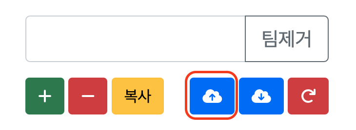
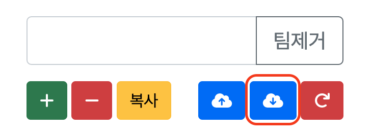
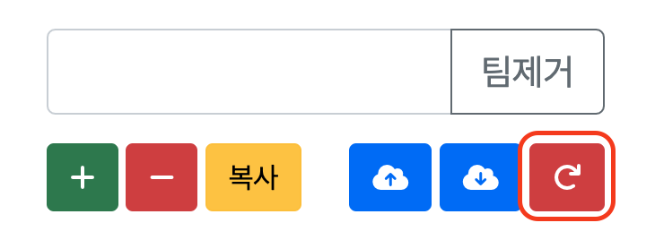
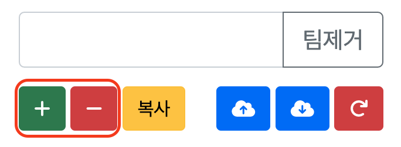

# 전시대 시간표 프로그램
## 업데이트 정보
### 1.1.0
#### 신규기능

* **저장하기** 
  * 
  * 정보를 저장하는 경우 뒤로가기 후 재접속 시 저장된 정보가 표시됩니다.
  * 저장된 정보는 덮어쓰기식으로 신규 정보 저장 시 기존 저장 정보는 사라집니다.
* **불러오기**
  * 
  * 가장 최근에 저장한 정보로 시간표를 불러옵니다.
  * 초기화 후에도 불러오기로 저장된 정보를 불러올 수 있습니다.
* **초기화**
  * 
  * 모든 정보를 초기화합니다.
  * 저장된 정보는 사라지지 않습니다.
* **복사전 검증**
  * 시작시간, 종료시간, 간격, 장소 미 입력 시 오류 문구가 나옵니다. ex) "시작시간 정보가 없습니다."

#### 변경점

* 구역추가, 구역제거 버튼 변경
  * 
  * 저장, 불러오기, 초기화 버튼 추가로 인한 공간 부족으로 구역추가, 구역제거 버튼이 간소화되었습니다.
